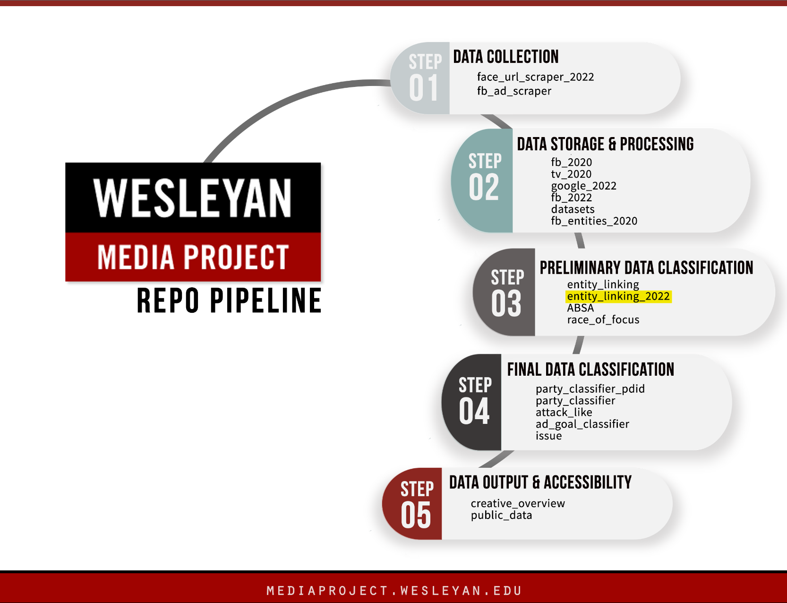

# Wesleyan Media Project - Entity Linking 2022

Welcome! This repo contains scripts for identifying and linking election candidates and other political entities in political ads on Google and Facebook. The scripts provided here are intended to help journalists, academic researchers, and others interested in the democratic process to understand which political entities are connected and how.

This repo is a part of the [Cross-platform Election Advertising Transparency Initiative (CREATIVE)](https://www.creativewmp.com/). CREATIVE has the goal of providing the public with analysis tools for more transparency of political ads across online platforms. In particular, CREATIVE provides cross-platform integration and standardization of political ads collected from Google and Facebook. CREATIVE is a joint project of the [Wesleyan Media Project (WMP)](https://mediaproject.wesleyan.edu/) and the [privacy-tech-lab](https://privacytechlab.org/) at [Wesleyan University](https://www.wesleyan.edu).

To analyze the different dimensions of political ad transparency we have developed an analysis pipeline. The scripts in this repo are part of the Data Classification Step in our pipeline.



## Table of Contents

[1. Video Tutorial](#1-video-tutorial)  
[2. Overview](#2-overview)  
[3. Setup](#3-setup)  
[4. Results Storage](#4-results-storage)  
[5. Thank You!](#5-thank-you)

## 1. Video Tutorial
If you are unable to see the video on Firefox with the error: 
- No video with supported format and MIME type found

Please try to watch the video via Chrome instead.
<video src="https://github.com/Wesleyan-Media-Project/entity_linking_2022/assets/104949958/2a7f456f-d2d9-439f-8e64-f9abb589069e" alt="If you are unable to see the video on Firefox with the error: No video with supported format and MIME type found, please try it on Chrome.">
</video>

## 2. Overview

This repo contains an entity linker for 2022 election data. The entity linker is a machine learning classifier and was trained on data that contains descriptions of people and their names, along with their aliases. Data are sourced from the 2022 WMP [person_2022.csv](https://github.com/Wesleyan-Media-Project/datasets/blob/main/people/person_2022.csv) and [wmpcand_120223_wmpid.csv](https://github.com/Wesleyan-Media-Project/datasets/blob/main/candidates/wmpcand_120223_wmpid.csv) --- two comprehensive files with names of candidates and other people in the political process. Data are restricted to general election candidates and other non-candidate people of interest (sitting senators, cabinet members, international leaders, etc.).

While this repo applies the trained entity linker to the 2022 US elections ads, you can also apply our entity linker to analyze your own political ad text datasets to identify which people of interest are mentioned in ads. This entity linker is especially helpful if you have a large amount of ad text data and you do not want to waste time counting how many times a political figure is mentioned within these ads. You can follow the setup instructions below to apply the entity linker to your own data.

There are separate folders for running the entity linker on Facebook and Google data. For both Facebook and Google, the scripts need to be run in the order of the three tasks: (1) constructing a knowledge base of political entities, (2) training the entity linking model, and (3) making inferences with the trained model. The repo provides reusable code for these three tasks. In more detail:

1. **Construct Knowledge Base of Political Entities**

   The first task is to construct a knowledge base of political entities (people) of interest.

   The knowledge base of people of interest is constructed from [facebook/knowledge_base/01_construct_kb.R](https://github.com/Wesleyan-Media-Project/entity_linking_2022/blob/issue-2/facebook/knowledge_base/01_construct_kb.R). The input to the file is the data sourced from the 2022 WMP persons file [person_2022.csv](https://github.com/Wesleyan-Media-Project/datasets/blob/main/people/person_2022.csv). The script constructs one sentence for each person with a basic description. Districts and party are sourced from the 2022 WMP candidates file [wmpcand_120223_wmpid.csv](https://github.com/Wesleyan-Media-Project/datasets/blob/main/candidates/wmpcand_120223_wmpid.csv), a comprehensive file with names of candidates.

   The knowledge base has four columns that include entities' `id`, `name`, `descr` (for description), and `aliases`. Examples of aliases include Joseph R. Biden being referred to as Joe or Robert Francis O’Rourke generally being known as Beto O’Rourke. Here is an example of one row in the knowledge base:

   | id        | name      | descr                                                                    | aliases                                                             |
   | --------- | --------- | ------------------------------------------------------------------------ | ------------------------------------------------------------------- |
   | WMPID1770 | Adam Gray | Adam Gray is a Democratic candidate for the 13rd District of California. | Adam Gray,Gray,Adam Gray's,Gray's,ADAM GRAY,GRAY,ADAM GRAY'S,GRAY'S |

   **Note**: The knowledge base construction is optional for running the scripts in this repo. You can run the inference scripts with our [existing knowledge base (for both Google and Facebook)](https://github.com/Wesleyan-Media-Project/entity_linking_2022/blob/main/facebook/data/entity_kb.csv). If you want to construct your own knowledge base, you would need to run the [knowledge base creation scripts](https://github.com/Wesleyan-Media-Project/entity_linking_2022/tree/main/facebook/knowledge_base). You would also need the scripts from the [datasets](https://github.com/Wesleyan-Media-Project/datasets) and [data-post-production](https://github.com/Wesleyan-Media-Project/data-post-production) repos. See those repos for further instructions.

2. **Train Entity Linking Model**

   The second task is to train an entity linking model using the knowledge base.

   Once the knowledge base of people of interest is constructed, the entity linker can be initialized with [spaCy](https://spacy.io/), a natural language processing library we use, in [facebook/train/02_train_entity_linking.py](https://github.com/Wesleyan-Media-Project/entity_linking_2022/blob/issue-2/facebook/train/02_train_entity_linking.py).

   **Note**: The training of the entity linking models is optional for running the scripts in this repo. You can run the inference scripts with our existing models (INCLUDE LINK TO EXISTING MODELS). If you want to train your own models, (INCLUDE SOME DESCRIPTION IF ANY.)

3. **Make Inferences with Trained Model**

   The third task is to make inferences with the trained model to automatically identify and link entities mentioned in new political ad text.

   To perform this task you can use the scripts in the inferences folders, [facebook/inference](https://github.com/Wesleyan-Media-Project/entity_linking_2022/tree/issue-2/facebook/inference) and [google/inference](https://github.com/Wesleyan-Media-Project/entity_linking_2022/tree/issue-2/google/inference). The folders incluced variations of scripts to disambiguate people, for example, multiple "Harrises" (e.g., Kamala Harris and Andy Harris).

## 3. Setup

The following setup instructions are for the default terminal on macOS/Linux. For Windows the steps are the same but the commands may be slightly different.

**Note**: The following instructions are for the inference scripts only as we provide a knowledge base and pre-trained models that are ready to use for Google and Facebook 2022 data. If you want to apply our inference scripts to a different time period (for example, another election cycle) or in a different context (for example, a non-U.S. election), then you would need to create your own knowledge base and train your own models. In such case, you can format your knowledge base according to our [existing knowledge base (for both Google and Facebook)](https://github.com/Wesleyan-Media-Project/entity_linking_2022/blob/main/facebook/data/entity_kb.csv). Please also note that the entity linking model training scripts require datasets from the [datasets](https://github.com/Wesleyan-Media-Project/datasets) repo and tables from the [data-post-production](https://github.com/Wesleyan-Media-Project/data-post-production) repo. These dependencies must be cloned into the same local top-level folder as this repo. For model training instructions, please refer to (INCLUDE WHERE TO FIND INSTRUCTION). The training may take multiple hours or even days, depending on your hardware.

1. To start setting up the inference scripts based on our existing knowledge base and pre-trained models, first clone this repo to your local directory:

   ```bash
   git clone https://github.com/Wesleyan-Media-Project/entity_linking_2022.git
   ```

2. The scripts in this repo are in [Python](https://www.python.org/) and [R](https://www.r-project.org/). Make sure you have both installed and set up before continuing. To install and set up Python you can follow the [Beginner's Guide to Python](https://wiki.python.org/moin/BeginnersGuide). The scripts in this repo were tested on Python 3.10. To install and set up R you can follow the [CRAN website](https://cran.r-project.org/).

3. To run the scripts in Python we recommend that you install a Python virtual environment:

   ```bash
   python3.10 -m venv venv
   ```

4. Start your Python virtual environment:

   ```bash
   source venv/bin/activate
   ```

   You can stop your virtual environment with:

   ```bash
   deactivate
   ```

5. Some scripts in this repo need [spaCy](https://spacy.io/) v3.2.4, particularly, spaCy's `en_core_web_lg`. To install
   `en_core_web_lg`, run:

   ```bash
   pip install spacy==3.2.4
   python3 -m spacy download en_core_web_lg
   ```
   Additionally, some scripts in this repository require pandas 2.1.1. To install, run:

    ```bash
   pip install pandas==2.1.1
   ```

7. Now, run the inferences scripts in this repo according to their numbering. For example, if you want to run the inference pipeline, you can run the scripts in the following order:

   1. [facebook/inference/01_combine_text_asr_ocr.R](https://github.com/Wesleyan-Media-Project/entity_linking_2022/blob/main/facebook/inference/01_combine_text_asr_ocr.R)
   2. [facebook/inference/02_entity_linking_inference.py](https://github.com/Wesleyan-Media-Project/entity_linking_2022/blob/main/facebook/inference/02_entity_linking_inference.py)
   3. [facebook/inference/03_combine_results.R](https://github.com/Wesleyan-Media-Project/entity_linking_2022/blob/main/facebook/inference/03_combine_results.R)

   To do so, run the following commands in your terminal:

   ```bash
   Rscript facebook/inference/01_combine_text_asr_ocr.R
   &&
   python3 facebook/inference/02_entity_linking_inference.py
   &&
   Rscript facebook/inference/03_combine_results.R
   ```

   **Note**: In order to successfully run each R script, you must first set your working directory. You can achieve this by adding the line `setwd("your/working/directory")`
   to the top of the R scripts, replacing `"your/working/directory"` with whatever directory you're running from. Additionally, make sure that the locations to which you're retrieving input files and/or sending output files are accurate.

   After successfully running the above scripts in the inference folder, you should see the following entity linking results in the `data` folder:

   - `entity_linking_results_fb22.csv.gz`
   - `entity_linking_results_fb22_notext.csv.gz`
   - `detected_entities_fb22.csv.gz`
   - `detected_entities_fb22_for_ad_tone.csv.gz`

   **Note**: The scripts in this repo are numbered in the order in which they should be run. Scripts that directly depend on one another are ordered sequentially. Scripts with the same number are alternatives. Usually, they are the same scripts on different data or with minor variations. For example, [facebook/train/02_train_entity_linking.py](https://github.com/Wesleyan-Media-Project/entity_linking_2022/blob/main/facebook/train/02_train_entity_linking.py) and [facebook/train/02_untrained_model.py](https://github.com/Wesleyan-Media-Project/entity_linking_2022/blob/main/facebook/train/02_untrained_model.py) are both scripts for training an entity linking model, but they differ slightly as to their training datasets.

## 4. Results Storage

When you run the inference scripts, the entity linking results are stored in the `data` folder. The data will be in `csv.gz` and `csv` format. Here is an example of the entity linking results [facebook/data/entity_linking_results_fb22.csv.gz](https://github.com/Wesleyan-Media-Project/entity_linking_2022/blob/issue-2/facebook/data/entity_linking_results_fb22.csv.gz):

| text                                                  | text_detected_entities | text_start | text_end | ad_id  | field            |
| ----------------------------------------------------- | ---------------------- | ---------- | -------- | ------ | ---------------- |
| Senator John Smith is fighting hard for Californians. | WMPID1234              | [8]        | [18]     | x_1234 | ad_creative_body |

In this example,

- The `text` field contains the raw ad text where entities were detected.
- The `text_detected_entities` field contains the detected entities in the ad text. They are listed by their WMPID. WMPID is the unique id that Wesleyan Media Project assigns to each candidate in the knowledge base(e.g. Adam Gray: WMPID1770). The WMPID is used to link the detected entities to the knowledge base.
- The `text_start` and `text_end` fields indicate the character offsets where the entity mention appears in the text.
- The `ad_id` field contains the unique identifier for the ad.
- The `field` field contains the field in the ad where the entity was detected. This could be, for example, the `page_name`, `ad_creative_body`, or `google_asr_text` (texts that we extract from video ads through Google Automatic Speech Recognition).

(INCLUDE [HARRY'S SCRIPTS ON ANALYZING DATA](https://github.com/Wesleyan-Media-Project/entity_linking_2022/issues/5))

## 5. Thank You

<p align="center"><strong>We would like to thank our financial supporters!</strong></p><br>

<p align="center">This material is based upon work supported by the National Science Foundation under Grant Numbers 2235006, 2235007, and 2235008.</p>

<p align="center" style="display: flex; justify-content: center; align-items: center;">
  <a href="https://www.nsf.gov/awardsearch/showAward?AWD_ID=2235006">
    
  </a>
</p>

<p align="center">The Cross-Platform Election Advertising Transparency Initiative (CREATIVE) is a joint infrastructure project of the Wesleyan Media Project and privacy-tech-lab at Wesleyan University in Connecticut.

<p align="center" style="display: flex; justify-content: center; align-items: center;">
  <a href="https://www.creativewmp.com/">
    
  </a>
</p>

<p align="center" style="display: flex; justify-content: center; align-items: center;">
  <a href="https://mediaproject.wesleyan.edu/">
    
  </a>
</p>

<p align="center" style="display: flex; justify-content: center; align-items: center;">
  <a href="https://privacytechlab.org/" style="margin-right: 20px;">
    
  </a>
</p>
